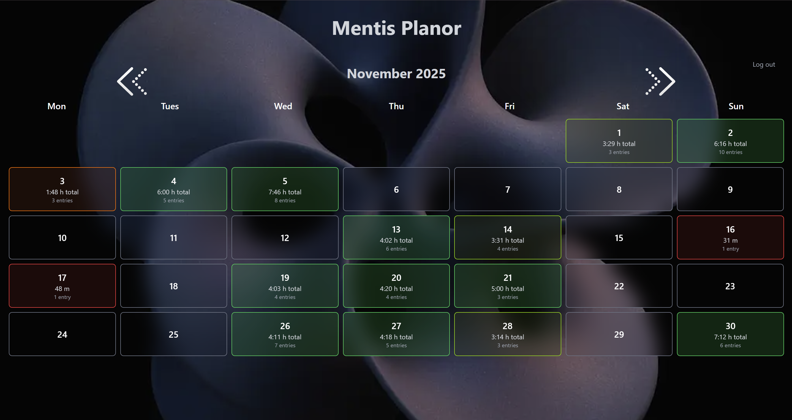
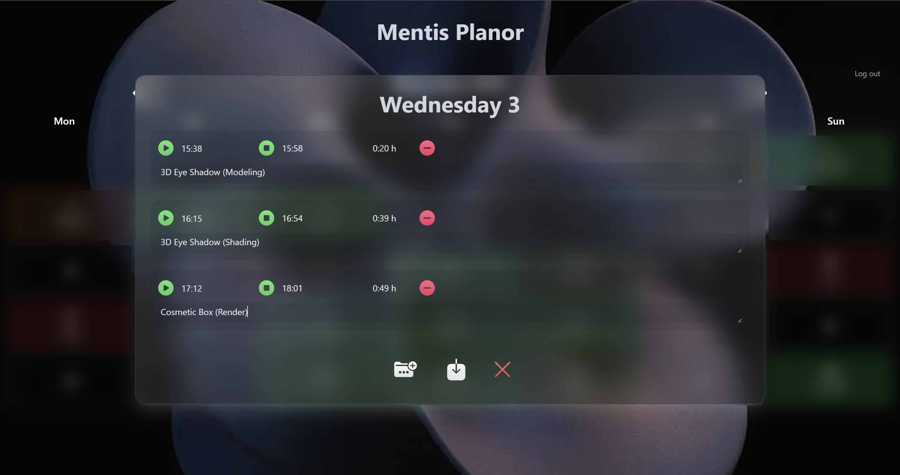

# Mentis Planor
## [Live Application (clickable link)](https://mentis-planor.vercel.app)

**Mentis Planor** is a personal time-tracking and planning calendar built with **Next.js**, **TypeScript**, and **Firebase**.  
It allows users to record how they spend time each day, track multiple time blocks per date, and visualize productivity over months with smooth UI transitions and persistent data synchronization.

## Preview

---

## ✨ Features

- 📆 **Interactive Calendar** — Navigate between months and record activities day by day.  
- 🕒 **Time Tracking** — Add multiple sessions per day with start/end times and automatic total duration calculation.  
- 🧠 **Session Notes** — Each entry supports a short description for context or task details.  
- ☁️ **Cloud Sync** — All data is stored in Firebase Firestore, tied to the authenticated user.  
- 🔒 **Authentication** — Integrated Firebase Auth for secure access.  
- 💎 **Smooth Animations** — Elegant open/close transitions and glass-like UI using TailwindCSS.  
- 🌗 **Gradient Theming** — Subtle cyan-to-deep-blue gradient background with customizable color support.

---

## 🛠️ Tech Stack

## Tech Stack

| Category | Technology |
|---------|-------------|
| Framework | **Next.js 15 (React 19 + TypeScript)** |
| Core Libraries | **React 19**, **React DOM 19** |
| State Management | **Jotai** |
| Styling | **Tailwind CSS 4** |
| Date Utilities | **date-fns** |
| Backend | **Firebase** |
| Auth | **Firebase Authentication** |
| Database | **Firestore** |
| Hosting | **Vercel / Firebase Hosting** |
| Tooling | **ESLint**, **TypeScript 5**, **Turbopack** |

## Dependencies

| Package | Purpose |
|--------|---------|
| **next** | Application framework |
| **react / react-dom** | Rendering and component system |
| **firebase** | Firestore, Auth, Storage SDK |
| **jotai** | Atomic state management |
| **date-fns** | Date utilities |

## Dev Dependencies

| Package | Purpose |
|--------|---------|
| **typescript** | Static typing |
| **eslint** + **eslint-config-next** | Linting |
| **tailwindcss** | CSS utilities |
| **@tailwindcss/postcss** | PostCSS integration |
| **@types/node** | Node.js types |
| **@types/react**, **@types/react-dom** | React type definitions |